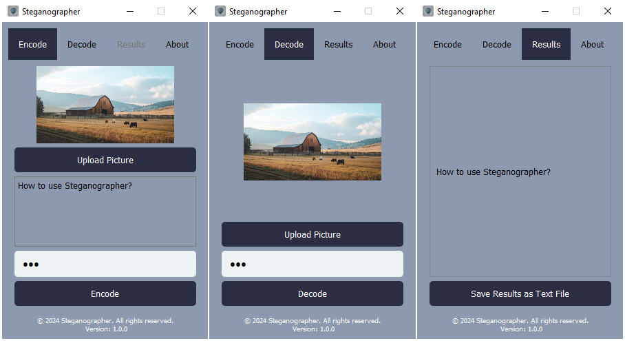

# Steganographer

## Introduction to Steganography

Steganography is the practice of concealing information within another medium, such as an image, video, or audio file. Unlike cryptography, which focuses on encrypting the content of messages, steganography aims to hide the very existence of the message. This technique has been used for centuries for secure communication and now finds applications in digital media for transmitting confidential information.

## Overview

Steganographer is a PyQt5-based application that allows users to encode and decode hidden messages within images using steganography techniques. The application ensures that your messages are securely embedded in an image and offers password protection for enhanced security.

## Features

- **Encoding**: Embed text messages within an image using a password for encryption (optional).
- **Decoding**: Extract hidden messages from images, with password authentication if required.
- **User-Friendly Interface**: Intuitive GUI built with PyQt5.
- **Secure Encryption**: Messages are encrypted using the AES encryption algorithm.
- **Cross-Platform**: Compatible with Windows, macOS, and Linux.

## Installation

1. Clone this repository:

   ```bash
   git clone https://github.com/KuroshNazari/Steganography.git
   ```

2. Install the required dependencies:

   ```bash
   pip install -r requirements.txt
   ```

3. Run the application:

   ```bash
   python Steganographer.py
   ```
   
## Dependencies

- PyQt5
- NumPy
- scikit-image
- pycryptodome
- Pillow

Install all dependencies by running:

```bash
pip install PyQt5 numpy scikit-image pycryptodome Pillow
```

## How to Use

### Encoding

1. Launch the application.
2. Navigate to the **Encode** tab.
3. Upload an image by clicking on **Upload Picture**.
4. Enter the text message you want to hide in the **Enter Text** box.
5. Optionally, enter a password for encryption in the **Password** field.
6. Click **Encode** to embed the message into the image. A new image with the hidden message will be saved in the same directory as the original image.

### Decoding

1. Navigate to the **Decode** tab.
2. Upload the image containing the hidden message by clicking on **Upload Picture**.
3. Enter the password (if applicable) in the **Password** field.
4. Click **Decode** to extract the hidden message.

### Viewing Results

- Navigate to the **Results** tab to view the output of the decoding process.
- Save the decoded message as a text file by clicking **Save Results as Text File**.

## Project Structure

- **Steganographer.py**: The main application file containing the GUI.
- **encoder.py**: The core encoding and decoding logic using steganography and AES encryption.
- **images/**: Contains the application icon and other static files.

## Security

- Messages are encrypted using the AES encryption algorithm, ensuring that only those with the correct password can decode the message.
- Passwords are padded or truncated to meet the AES key size requirements (16 bytes).

## Screenshots



## Future Enhancements

- Support for more image formats.
- Enhance encryption using advanced modes like CBC.
- Add drag-and-drop functionality for uploading images.
- Create a settings menu for additional customization.

### Learn More
- Watch this: [Secrets Hidden in Images (Steganography)](https://youtu.be/TWEXCYQKyDc?si=fR4rVeFElxPHoGoD)
- Watch this: [This Image is My Password](https://youtu.be/q71Z3RBvzIA?si=Njpoi-splKxOEOcA)

## Developer Information

- **Email**: [k.nazari1381@gmail.com](mailto\:k.nazari1381@gmail.com)
- **Telegram**: [KuroshNazari](https://t.me/KuroshNazari)

## License

This project is licensed under the MIT License. See the LICENSE file for details.

